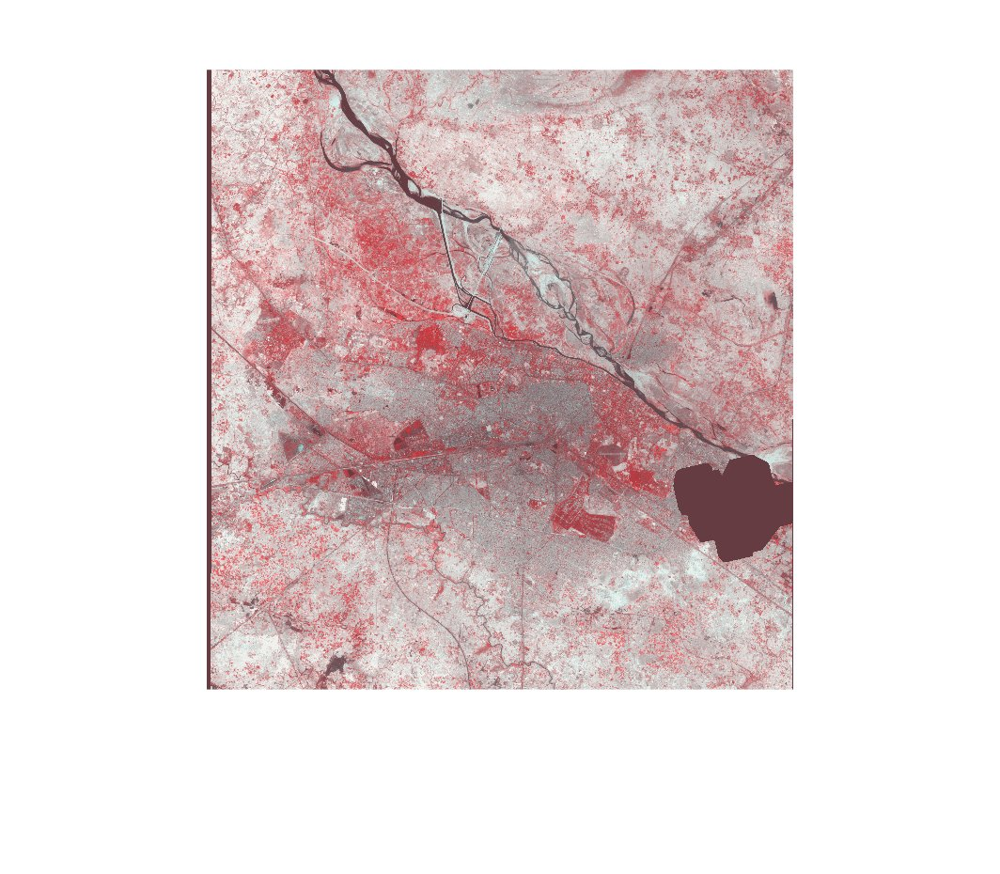

# Advanced-Image-Processing-and-Color-Composite-Analysis-for-Remote-Sensing-Applications
Utilized MATLAB to generate False Color Composites (FCC) from RGB bands, enhancing visual interpretation of remote sensing data. Applied linear stretching and histogram analysis to improve image contrast and detail for accurate land cover differentiation. Employed Look-Up Tables (LUTs) to adjust color and brightness, optimizing landscape analysis.
This project focuses on utilizing MATLAB to process remote sensing data. The key tasks performed include generating False Color Composites (FCC) from RGB bands, applying linear stretching techniques, and using histogram analysis to enhance image contrast and detail. The project also explores the application of Look-Up Tables (LUTs) to adjust and evaluate image color and brightness, which are crucial for accurate land cover differentiation and landscape analysis. Understanding and implementing image processing techniques like FCC, histogram equalization, and LUTs in MATLAB will enable further exploration into areas such as satellite image analysis, urban planning, disaster management, and agricultural monitoring. 

## Project Images

